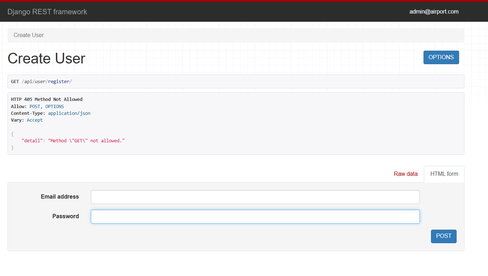
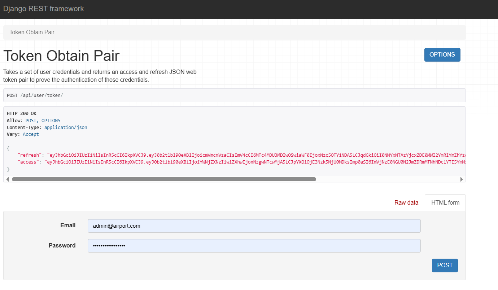

# Airport API

API service for airport management written on DRF

## Features

* JWT authenticated
* Admin panel /admin/
* Documentation is located at /api/doc/swagger/
* Managing orders and tickets
* Managing airplane flights and routes
* Filtering flights, airplanes and routes

## 🛠 Prerequisites

Before you begin, ensure you have the following installed on your system:

1. **Python 3.10 or higher**: [Download here](https://www.python.org/downloads/).
2. **PostgreSQL**: You must have PostgreSQL installed and running on your machine.
   - **Windows**: Download and install via the [official EDB installer](https://www.enterprisedb.com/downloads/postgres-postgresql-downloads).
   - **macOS**: Use `brew install postgresql`.
   - **Linux**: Install via your package manager (e.g., `sudo apt install postgresql`).
3. **Database Setup**:
   - Create a new database in PostgreSQL (e.g., `airport_db`).

## ⚙️ Installation & Local Setup

1. **Clone the repository:**
   ```bash
   git clone [https://github.com/pawunder/airport-app.git](https://github.com/pawunder/airport-app.git)
   cd airport-app
2. **Create and activate a virtual environment:**
   ```bash
   # On Windows:
   venv\Scripts\activate

   # On macOS/Linux:
   source venv/bin/activate

3. **Install dependencies:**
    ```bash
    pip install -r requirements.txt
4. **Set environment variables:**
Configure your local environment variables to connect to your installed PostgreSQL instance:

    ```bash
    # On Windows (Command Prompt):

    set DB_HOST=localhost
    set DB_NAME=your_db_name
    set DB_USER=your_db_username
    set DB_PASSWORD=your_db_password

5. **Prepare the database and run**
    ```bash
    #Apply migrations to create the database structure:
    python manage.py migrate


6. **Finally, start the development server:**
    ```bash
    python manage.py runserver
   
7. **Create superuser:**
    ```bash
    python manage.py createsuperuser
   

## 🐳 Docker Setup

If you prefer to use Docker instead of a local environment, follow these steps:

1. **Prerequisites:**
   - Make sure you have **Docker** and **Docker Compose** installed on your system.

2. **Configure environment variables:**
   Create a `.env` file in the root directory and add the following required configuration:
   ```bash
   POSTGRES_DB=your_db_name
   POSTGRES_USER=your_db_user
   POSTGRES_PASSWORD=your_db_password
   SECRET_KEY=your_secret_key
   DB_HOST=db
   
3. **Build and run the containers:**
    Use the following command to build the images and start the services:
    ```bash
    docker-compose up --build
   
4. **Create a superuser:**
   To access the admin panel, create a superuser inside the container:
    ```bash
    docker-compose exec app python manage.py createsuperuser

## 📦 Data Seeding

You can populate the database with test data (airports, flights, crew, and users) using the `data.py` script.

1. **Running locally:**
If you are running the project in your local virtual environment:
    ```bash
    python data.py
2. **Running with Docker:**
If you are using Docker, execute the script inside the running container:
    ```bash
    docker-compose exec app python data.py
   
3. **Test Accounts:**
After running the script, the following accounts will be created automatically:
    ```bash
    Admin: admin@airport.com
    Password: password123456789

    Passenger: passenger@gmail.com
    Password: password123456789
   

## 🐳 DOCKERHUB 
You can download the latest image from our Docker Hub repository:

    docker pull pawunder/airport-app:tagname

## Authentication & Registration
This project uses JWT (JSON Web Token) for secure authentication via Django REST Framework.

1. User Registration
To create a new account, send a POST request to the registration endpoint:

    ```bash
    POST /api/user/register/


2. Obtaining Tokens
Once registered, you can obtain your access and refresh tokens by sending a POST request with your credentials:

   ```bash
   POST /api/user/token/
 

3. Using the API
To access protected endpoints, include your access token in the Authorization header:

HTTP
   ```bash
   Authorization: Bearer <your_access_token>